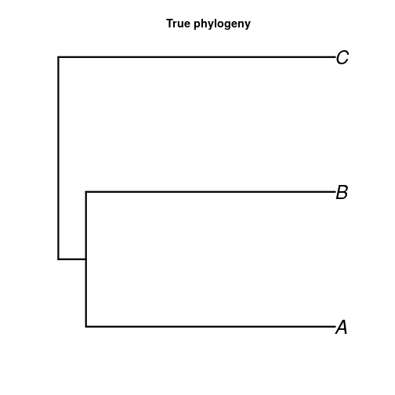
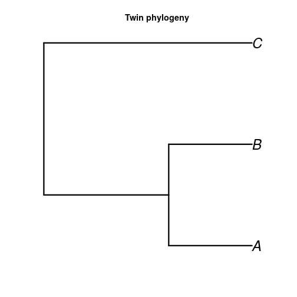
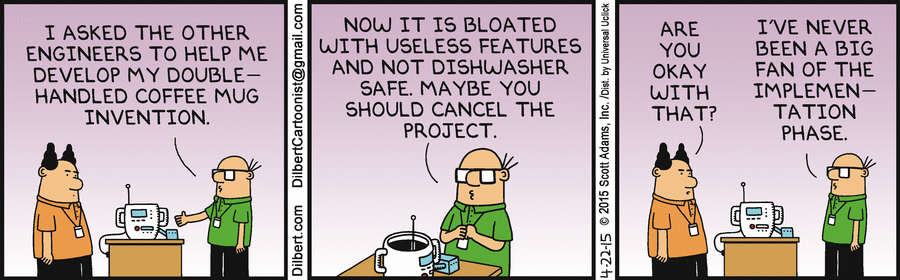

Partial Function Evaluation In R
========================================================
author: Richel J.C. Bilderbeek
date: 2019-11-08
autosize: true

[https://github.com/richelbilderbeek/partial_function_evaluation_in_r](https://github.com/richelbilderbeek/partial_function_evaluation_in_r)


Biological context
========================================================



***



Practice
========================================================


Features
========================================================

 * Same number of taxa yes/no
 * Same sum of branch lengths yes/no
 * Same crown age yes/no
 * Speciation model: none, Yule, BD, etc.
 * Simulation method: random, maximum likelihood, etc..
 * Maximum number of simulation attempts

***

```
sim_twin_tree <- function(
  true_tree,
  ...
)
```


Simpler context
========================================================

 * R package: `greetr`


```r
library(greetr)
```


***


```r
params <- create_params(
  name = "Richel"
)

greet(params)
```


```
Hello Richel
```

Implementation
========================================================


```r
create_params <- function(
  name
) {
  list(
    name = name
  )
}
```

***


```r
greet <- function(params) {
  cat(
    paste(
      "Hello",
      params$name
    )
  )
}
```

Practice
========================================================


New use case: specify the greeting word
========================================================


***


```r
params <- create_params(
  greeting = "Howdy",
  name = "Richel"
)
greet(params)
```


```
Howdy Richel
```

New use case: specify the greeting word
========================================================


```r
create_params <- function(
  name,
  greeting = "Hello"
) {
  list(
    name = name,
    greeting = greeting
  )
}
```

***


```r
greet <- function(params) {
  cat(
    paste(
      params$greeting,
      params$name
    )
  )
}
```

New use case: greeting word depends on the language
========================================================


***


```r
params <- create_params(
  language = "Dutch",
  name = "Richel"
)
greet(params)
```


```
Hallo Richel
```

New use case: greeting word depends on the language
========================================================


```r
params <- create_params(
  name,
  greeting = "Hello",
  language = NA
) {
  list(
    # ...
    language = language
  )
}
```

***


```r
greet <- function(params) {
  if (
    !is.na(params$language)
  ) {
    # Greet in language
  } else {
    # Greet with greeting
  }
}
```

 * Code smell: not all parameters are used in all contexts

New use case: greeting word depends on the weather
========================================================


***


```r
params <- create_params(
  weather = "sunny",
  temperature = 25,
  name = "Richel"
)
greet(params)
```


```
Hello Richel :sunglasses: :cocktail:
```

New use case: greeting word depends on the weather
========================================================


```r
params <- create_params(
  # ...
  weather = NA,
  temperature = NA,
) {
  list(
    # ...
    weather = weather,
    temperature =
      temperature
  )
}
```

 * Code smell: if one parameter is used, so must another

***


```r
greet <- function(params) {
  if (!
      is.na(params$weather)
  ) {
    # Must specify both
    testit::assert(
      !is.na(
        params$temperature
      )
    )
    # ...
  }
  # ...
}
```

Uh...
========================================================



How to do better?
========================================================


Solution
========================================================

# Instead of *deducing what to do* from the function arguments,
# let the user *supply the function* what to do

Recap: using function names as variables
========================================================


```r
f <- print
f("Hello")
```

```
[1] "Hello"
```

```r
f <- cat
f("Hello")
```

```
Hello
```

***


greetr default use again
========================================================


```r
params <- create_params(
  name = "Richel"
)

greet(params)
```


```
Hello Richel
```

***


Implementation
========================================================


```r
create_params <- function(
  name,
  greet_function = get_default_greet_function()
) {
  list(
    name = name,
    greet_function = greet_function
  )
}
```

### Instead of `get_default_greet_function()`,
### we could also put a function name there

Implementation
========================================================


```r
get_default_greet_function <- function() {
  function(name) {
    cat(paste("Hello", name))
  }
}
```

### Instead of using an anonymous function,
### we could also call a named function
### (e.g. `do_default_greeting`) there


```r
greet <- function(params) {
  params$greet_function(params$name)
}
```

New use case: specify the greeting word
========================================================


***


```r
params <- create_params(
  greet_function =
    get_use_greet_word_fun(
      greet_word = "Howdy"
    ),
  name = "Richel"
)
greet(params)
```


```
Howdy Richel
```

Implementation that remains unchanged
========================================================


```r
create_params <- function(
  name,
  greet_function = get_default_greet_function()
) {
  list(
    name = name,
    greet_function = greet_function
  )
}
```


```r
greet <- function(params) {
  params$greet_function(params$name)
}
```


Implementation
========================================================


```r
get_use_greet_word_fun <- function(
  greet_word
) {
  pryr::partial(
    function(name, greet_word) {
      cat(paste(greet_word, name))
    },
    greet_word = greet_word
  )
}
```


(Does it really work?)
========================================================


***


```r
params <- create_params(
  greet_function =
    get_use_greet_word_fun(
      greet_word = "Howdy"
    ),
  name = "Richel"
)
greet(params)
```

```
Howdy Richel
```

New use case: greeting word depends on the language
========================================================


```r
get_use_language_word_fun <- function(
  language
) {
  pryr::partial(
    function(name, language) {
      testit::assert(language == "Dutch") # TODO
      cat(paste("Hallo", name))
    },
    language = language
  )
}
```


(Does it really work?)
========================================================


***


```r
params <- create_params(
  greet_function =
    get_use_language_word_fun(
      language = "Dutch"
    ),
  name = "Richel"
)
greet(params)
```

```
Hallo Richel
```

New use case: greeting word depends on the weather
========================================================


```r
get_weather_dep_greet_fun <- function(
  weather,
  temperature
) {
  pryr::partial(
    function(name, weather, temperature) {
      testit::assert(weather == "sunny") # TODO
      testit::assert(temperature >= 25) # TODO
      cat(paste("Hello", name,
        ":sunglasses:", ":cocktail:"))
    },
    weather = weather,
    temperature = temperature
  )
}
```

(Does it really work?)
========================================================


***


```r
params <- create_params(
  greet_function =
    get_weather_dep_greet_fun(
      weather = "sunny",
      temperature = 25
    ),
  name = "Richel"
)
greet(params)
```

```
Hello Richel :sunglasses: :cocktail:
```

We did better!
========================================================


In pirouette
========================================================


In pirouette's old days
========================================================


```r
create_twin_tree <- function(
  phylogeny,
  twinning_params =
    create_twinning_params()
) {
  if (twinning_params$twin_model
    == "birth_death"
  ) {
    # ...
  }
  # ...
  twin_tree
}
```

### We hid complexity in the `twinning_params`

In pirouette's old days
========================================================


```r
create_twinning_params <- function(
  twin_model = "birth_death",
  method = "random_tree",
  n_replicates = 1e4,
  # ...
  )
) {
  list(
    # ...
  )
}
```

### Code smell: not all parameters are used in all contexts

pirouette's current glory
========================================================


```r
create_twin_tree <- function(
  phylogeny,
  twinning_params = create_twinning_params()
) {
  # ...
  twinning_params$sim_twin_tree_function(phylogeny)
}
```

### This function has become close to trivial


pirouette's current glory
========================================================


```r
create_twinning_params <- function(
  sim_twin_tree_function = create_sim_bd_twin_tree_function()
) {
  list(
    sim_twin_tree_function = sim_twin_tree_function,
    # ...
  )
}
```

### New code smell: long function names

Get partially evaluated function
========================================================


```r
create_sim_bd_twin_tree_function <- function(
  method = "random_tree",
  n_replicates = 1e4
) {
  pryr::partial(
    sim_bd_twin_tree,
    method = method,
    n_replicates = n_replicates
  )
}
```

### Still a code smell here: not all arguments are used in all contexts

Function doing the real work
========================================================


```r
sim_bd_twin_tree <- function(
  true_phylogeny,
  method = "random_tree",
  n_replicates = 1e4
) {
  # ...
}
```

### Still a code smell here: not all arguments are used in all contexts


How long do you know this technique?
========================================================

 * Since at least a decade
 * Cesar Martinez used it in his R work
 * In C++, use Boost.HOF

***


Why tell now?
========================================================

 * Partial function evaluation is hard
 * Tests need to be in place first

> Debugging is twice as hard
> as writing the code in the first place.
>
> Therefore, if you write the code
> as cleverly as possible,
> you are, by definition,
> not smart enough to debug it.
>
> Brian Kernighan


***


Conclusion
========================================================

With partial function evaluation...

 * functions will have less arguments
 * code can become complex in the right spots
 * you need to think deeper
 * you need good tests
 * you may get very long function names
 * you can one day say: 'It is Done'

***


Use with caution!

Questions?
========================================================


